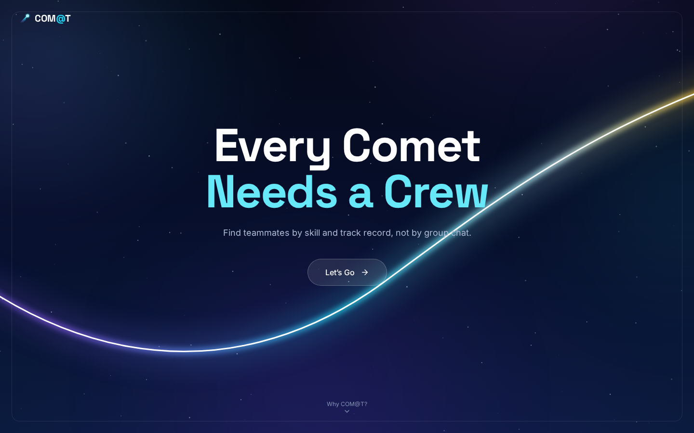
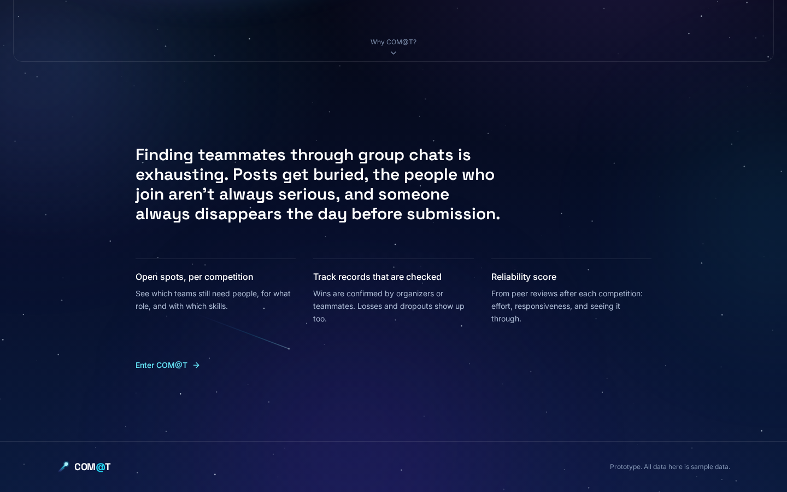
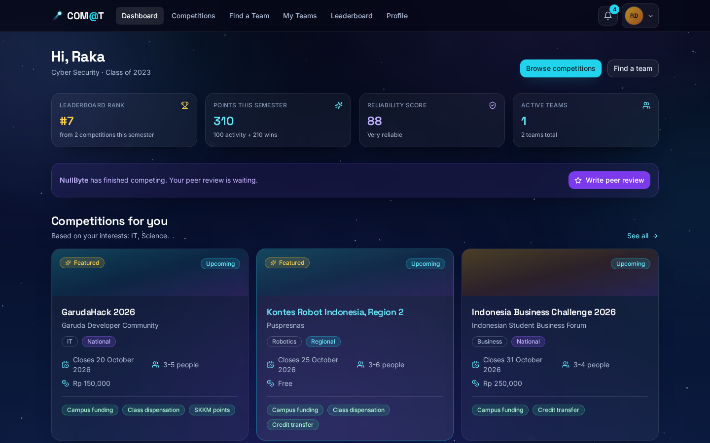
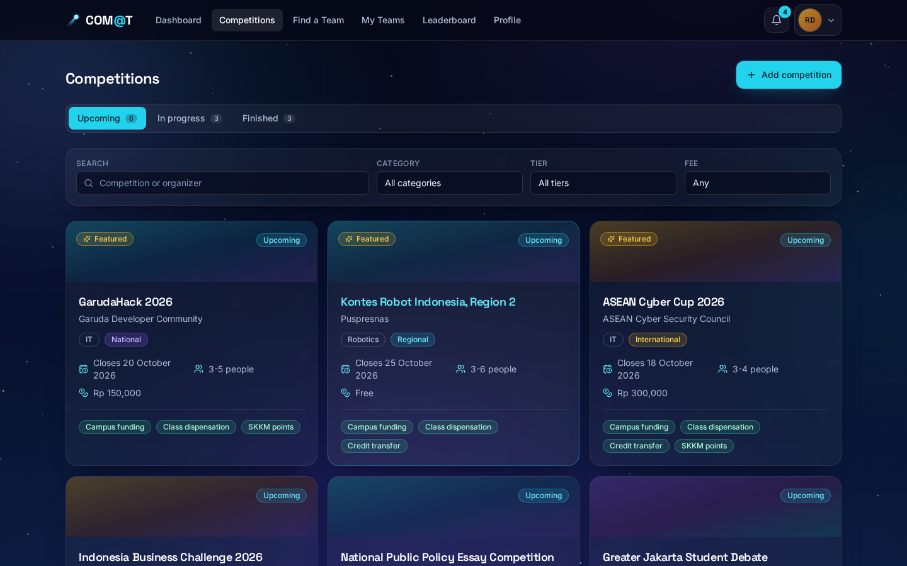
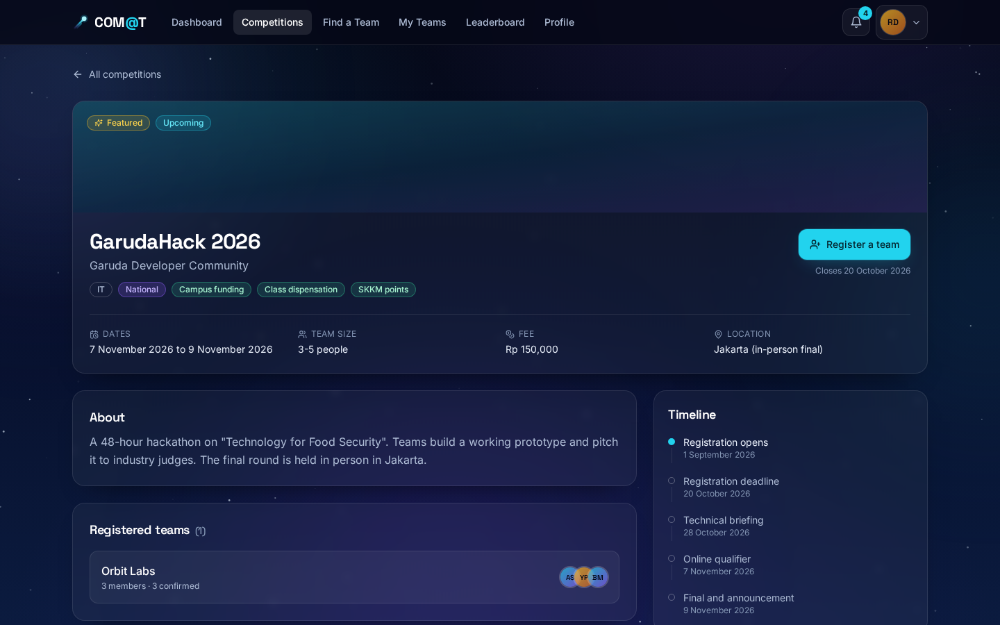
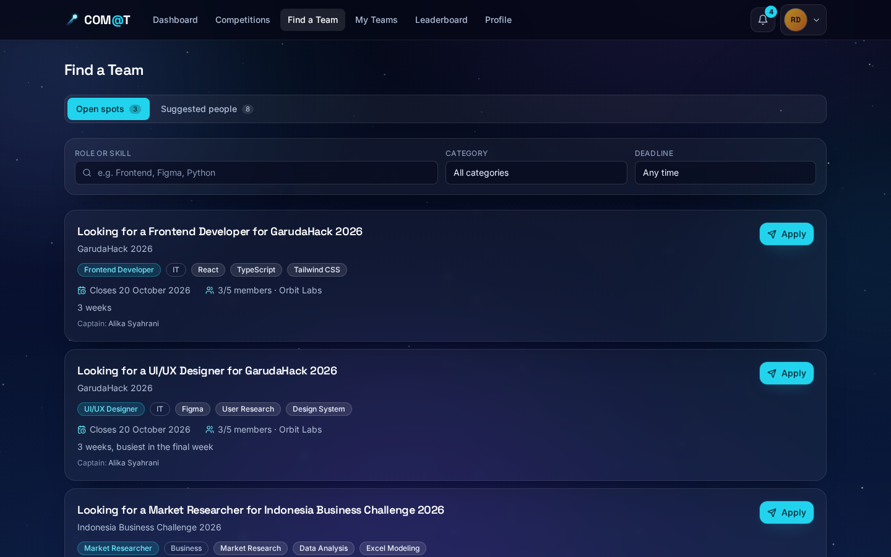
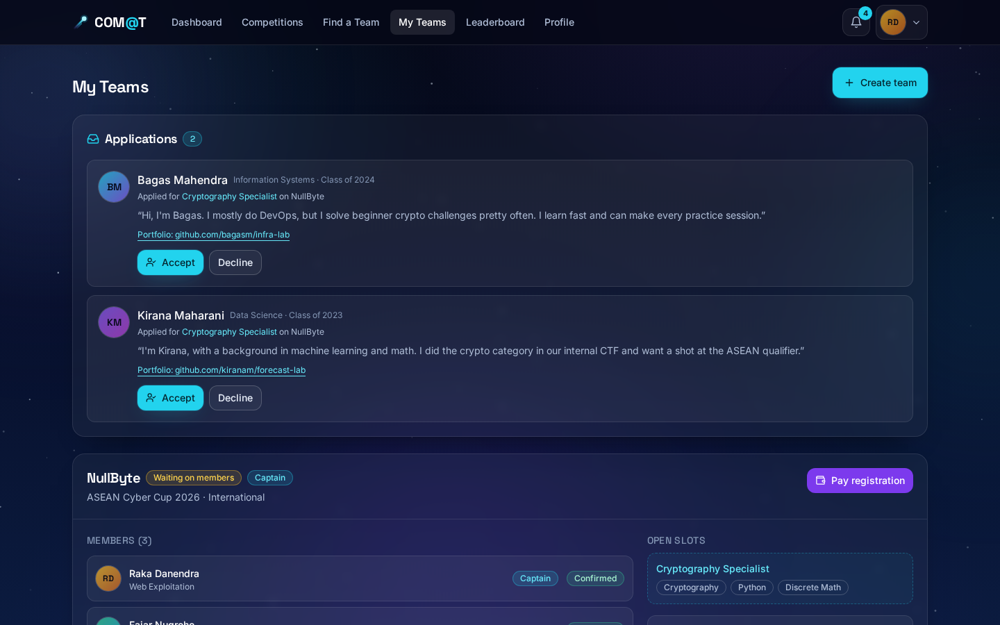
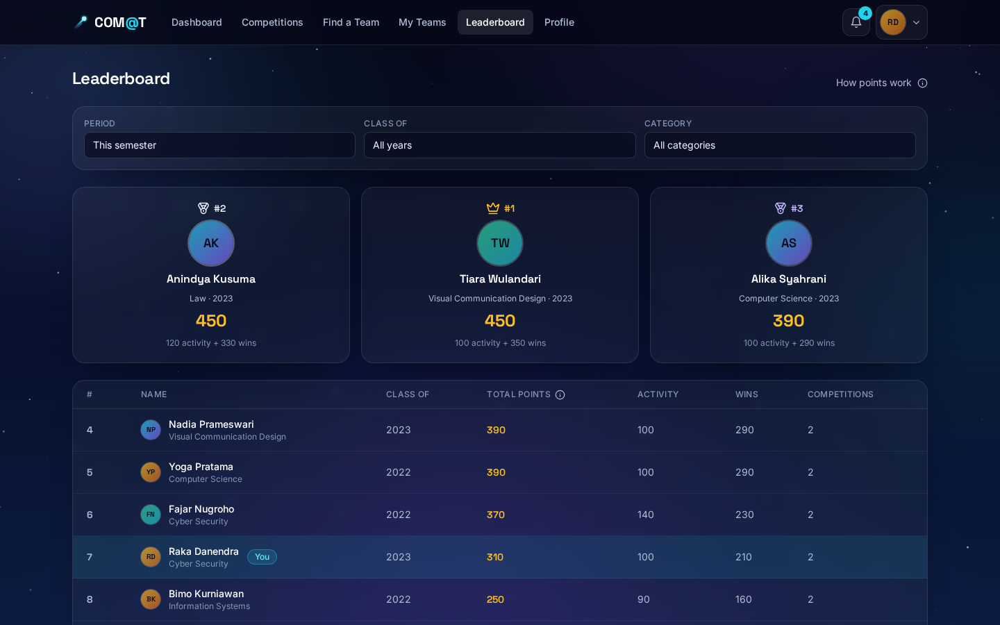
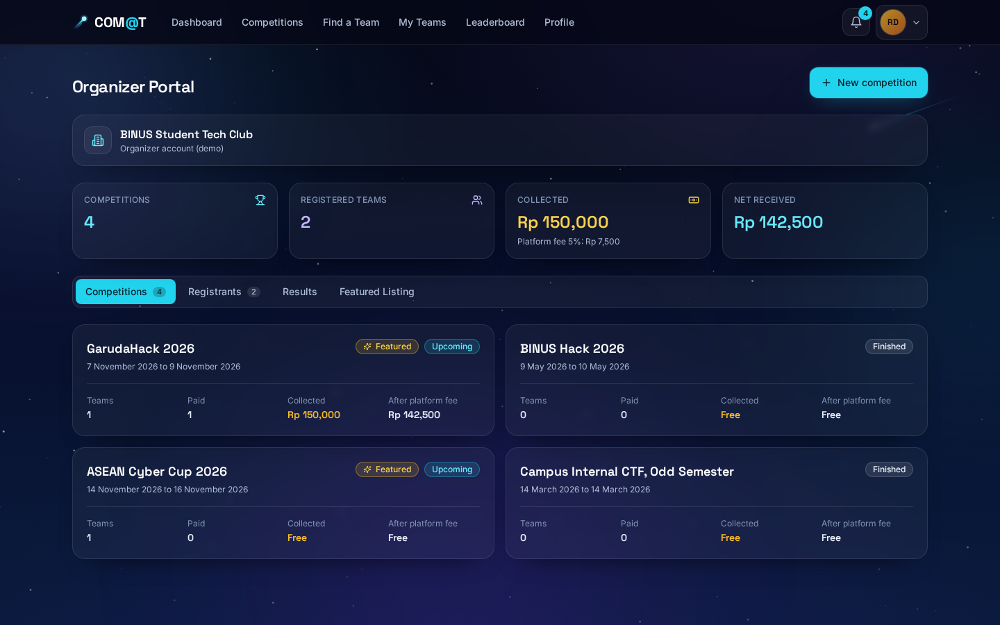
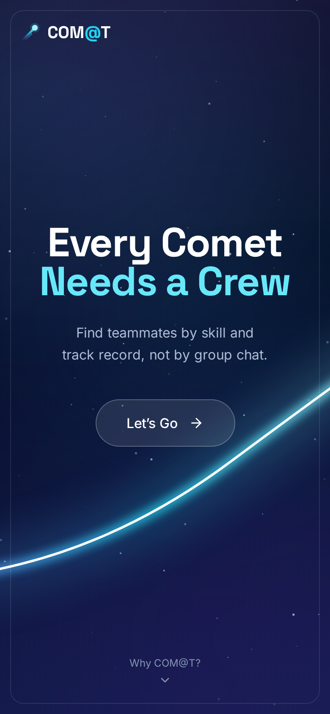

<div align="center">

# ☄️ COM@T (Competition At)

### Every comet needs a crew.

**Find competition teammates you can actually count on.** COM@T matches students from different majors
into competition teams by **skills**, **checked track records**, and a **reliability score**, not by
scrolling a group chat that buries every post within minutes.


<br />



<sub>The intro screen. A comet falls, draws an arc of light, and one <b>Let's Go</b> button takes you in.</sub>

</div>

---

## 🌌 The problem

Every semester brings dozens of competitions: hackathons, business cases, robotics, debate, CTFs.
Finding them is easy. **Finding three or four people whose skills fit together, and who will stick
around until submission day, is the hard part.**

- 📉 Recruitment posts get buried in group chats within minutes.
- 👻 A team forms, then someone disappears the day before submission.
- 🎲 You can't tell in advance whether a new teammate will pull their weight.

<p align="center">
  
</p>

---

## ✨ What makes it different

<table>
<tr>
<td width="33%" valign="top">

### 🔍 Open spots, per competition
Every competition shows which teams still need people, for what **role**, and with which
**skills**. Apply in one click.

</td>
<td width="33%" valign="top">

### ✅ Track records that are checked
Wins are confirmed by the **organizer or teammates**, not self-reported. Losses and dropouts show
up too.

</td>
<td width="33%" valign="top">

### 🛡️ Reliability score
Built from **peer reviews** after every competition: effort, responsiveness, and seeing it through.
Just signing up for lots of competitions doesn't raise it.

</td>
</tr>
</table>

---

## 📸 A look inside

<table>
<tr>
<td width="50%">

<p align="center"><b>Dashboard</b>: your rank, points, reliability score, and competitions picked for your interests.</p>
</td>
<td width="50%">

<p align="center"><b>Competitions</b>: filter by category, tier (Internal → International), and fee.</p>
</td>
</tr>
<tr>
<td width="50%">

<p align="center"><b>Competition detail</b>: dates, timeline, campus benefits, and registered teams.</p>
</td>
<td width="50%">

<p align="center"><b>Find a Team</b>: open spots with the exact skills each team needs.</p>
</td>
</tr>
<tr>
<td width="50%">

<p align="center"><b>My Teams</b>: accept or decline applications and manage your roster.</p>
</td>
<td width="50%">

<p align="center"><b>Leaderboard</b>: activity points plus win points, weighted by competition tier.</p>
</td>
</tr>
<tr>
<td width="50%">

<p align="center"><b>Organizer portal</b>: registrants, collected fees, results, and Featured Listings.</p>
</td>
<td width="50%" align="center">

<p align="center"><b>Mobile</b>: works on phone screens too.</p>
</td>
</tr>
</table>

---

## 🏆 How the points work

Points only count for competitions registered **on COM@T before they start**, and are weighted by
tier:

| Tier          | Weight | Activity pts | 1st place | 2nd place | 3rd place | Finalist |
| ------------- | :----: | :----------: | :-------: | :-------: | :-------: | :------: |
| Internal      |   ×1   |      20      |    100    |    75     |    55     |    35    |
| Regional      |   ×2   |      40      |    200    |    150    |    110    |    70    |
| National      |   ×3   |      60      |    300    |    225    |    165    |   105    |
| International |   ×4   |      80      |    400    |    300    |    220    |   140    |

The **reliability score** only appears after a student has joined **at least 3 competitions**, so one
bad team can't define anyone.

---

## 🚀 Try it in 30 seconds

**On Windows:** double-click **`start.bat`**. It installs packages the first time, then opens the
site at `http://localhost:5173`. Close the window to stop it.

**Anywhere else:**

```bash
git clone https://github.com/soulahuden/competition-at.git
cd competition-at
npm install
npm run dev      # → http://localhost:5173
```

```bash
npm run build    # production build + typecheck
```

> **Note:** This is a **frontend-only prototype**. Every student, team, and competition is sample
> data kept in memory. There is no backend, no sign-up, and no real payment.

---

## 🎬 Full demo walkthrough

Use **Demo: switch persona** in the avatar menu to play both the **applicant** and the **team captain**.

1. **Competitions** (`/lomba`): open a competition and click **Register a team**.
2. **Create a team**: pick the competition, name your team and invite members, then add the open slots.
   Paid competitions continue to a sample checkout (QRIS, Virtual Account, or e-wallet).
3. The open slots **show up right away** in **Find a Team** (`/cari-tim`).
4. Switch to another student and click **Apply**. The button changes to *Applied*.
5. Switch back to the captain, go to **My Teams** (`/tim`), find the request under **Applications**, and
   click **Accept**. The slot fills and the new member joins.
6. **Organizer portal** (`/penyelenggara`): open **Results**, click **Enter results**, pick the winners, and
   **Announce results**. The competition closes.
7. Back in **My Teams**: **Write peer review**, answering 3 questions on a 1 to 5 scale for each
   teammate. There is no free-text comment box.
8. **Leaderboard** (`/leaderboard`): activity and win points go up, and your own row is highlighted.

---

## 🧱 Under the hood

**Stack:** Vite · React 18 · TypeScript · Tailwind CSS · React Router · lucide-react

```
src/
├─ data/        sample data (20 students, 12 competitions, 6 teams, applications, notifications)
├─ services/    async wrappers around the data, the only path for data access
├─ context/     global state (Auth, Store, Notification)
├─ components/  ui/ (reusable) · layout/ · space/ (starfield, comet) · domain/
├─ features/    multi-step flows: create-team, checkout, peer-review
├─ pages/       one file per route
└─ lib/         date and rupiah formatting, point weights, reliability rules
```

### 🔌 Plugging in a real backend

Components **only** call `src/services/*`. To connect an API, replace the body of each service
function with a `fetch`. Signatures like `getCompetitions()` and `applyToTeam()` stay the same, so
**no component has to change**.

### 🌠 The intro animation

Route `/` is a full-screen intro. A small comet falls across the sky, an arc of light traces its
path, the headline rises in, and there is a single **Let's Go** button. Pressing it plays the exit
animation (the comet streaks off with a flash of light) and lands you on `/dashboard`. Scroll down
(**Why COM@T?**) for a short explanation of the problem and the three ideas behind the app.

♿ All motion (starfield, comet, transitions) is **turned off completely** under
`prefers-reduced-motion: reduce`. The arc appears complete and the button navigates instantly.

---

## 📝 Notes

- The prototype's reference date is **28 September 2026** (`TODAY` in `src/lib/format.ts`).
- The interface is in **English**. Route paths (`/lomba`, `/cari-tim`, `/tim`, `/penyelenggara`) still
  use their original Indonesian names.
- Payments and Featured Listing pricing are display-only. No real transactions happen.

<div align="center">

<br />

**Built at BINUS University** ☄️

*Every comet needs a crew.*

</div>
